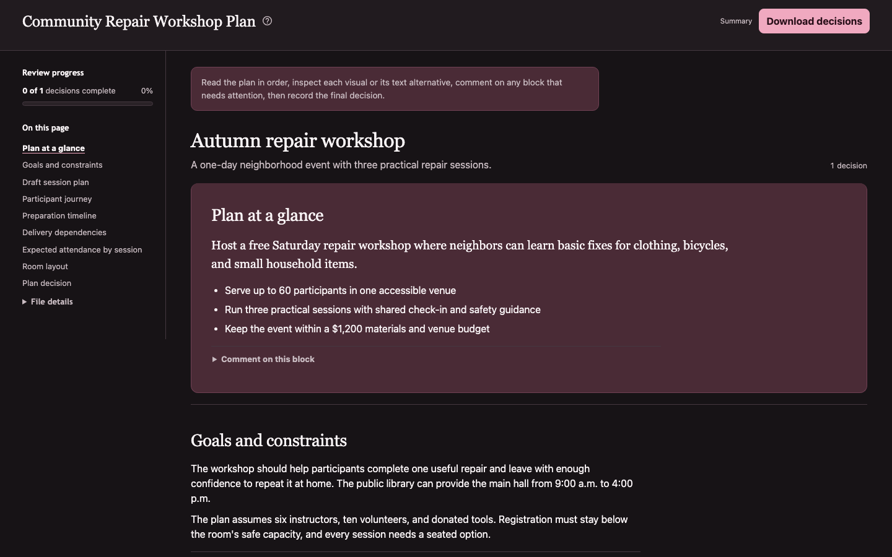
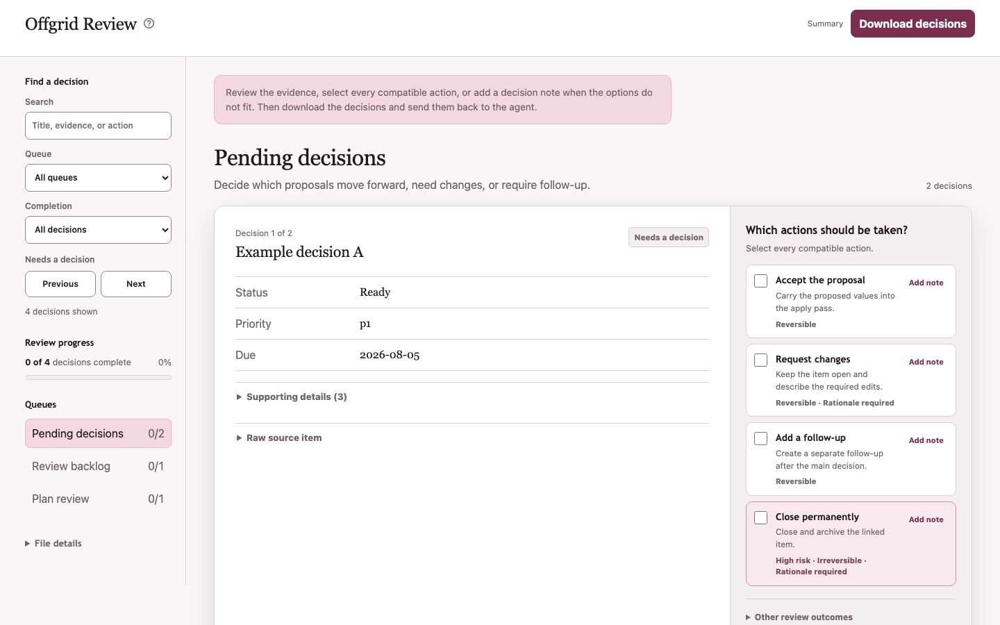
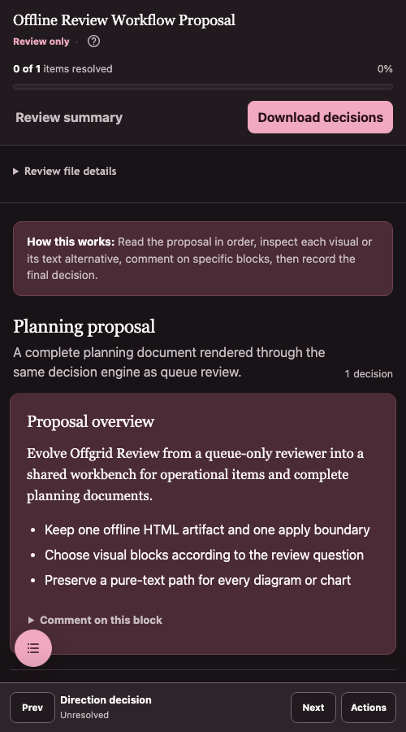
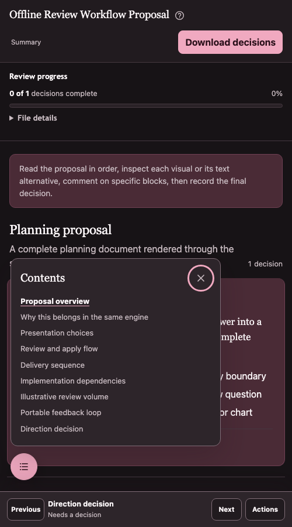

# Offgrid Review

Offgrid Review turns deterministic JSON and a review specification into one
self-contained HTML workbench. Reviewers inspect evidence, record explicit
decisions and annotations, then return structured JSON.

The generated file needs no server, build process, package install, or runtime
network access. It captures decisions but never applies them to an external
system.

[Quick start](#quick-start) · [Agent skill](#agent-skill) ·
[Core concepts](#core-concepts) · [Reference](#reference)



_One engine handles complete documents and queue-based review._

## How it works

1. A read-only script or agent gathers deterministic source data as JSON.
2. A review specification defines the questions, evidence, actions, and document
   blocks needed for this review.
3. The generator combines both inputs into one offline HTML file.
4. A person reviews the file and downloads decision JSON.
5. A separate apply pass verifies current state before making approved changes.

```text
source data + review specification
              ↓
       offline HTML review
              ↓
         decision JSON
              ↓
      verified apply pass
```

This pattern is useful when a person needs to review more structured material
than fits comfortably in chat, but the underlying facts can be gathered before
the review begins.

## Quick start

Offgrid Review requires Python 3.10 or later and uses only the standard library.

```bash
git clone https://github.com/jd-santos/offgrid-review.git
cd offgrid-review

python3 skills/offgrid-review/scripts/review_console.py \
  --data skills/offgrid-review/scripts/review-data.example.json \
  --spec skills/offgrid-review/scripts/review-spec.example.json \
  --out /tmp/offgrid-review.html
```

Open `/tmp/offgrid-review.html` in a browser. Select one or more compatible
actions, add notes where needed, and use **Download JSON** to export the result.

<details>
<summary>Generate the planning-document example</summary>

```bash
python3 skills/offgrid-review/scripts/review_console.py \
  --data skills/offgrid-review/scripts/review-plan-data.example.json \
  --spec skills/offgrid-review/scripts/review-plan-spec.example.json \
  --out /tmp/offgrid-review-plan.html
```

</details>

Start with the [usage guide](skills/offgrid-review/reference/usage.md) when
building a new review. The
[artifact contract](skills/offgrid-review/reference/artifact-contract.md)
documents the complete data, specification, annotation, and decision formats.

## Agent skill

The reusable skill lives at
[`skills/offgrid-review`](skills/offgrid-review). It guides an agent through
collecting read-only source data, writing the review specification, generating
the artifact, and handling the exported decisions through a separate apply
pass.

Agent systems that discover `skills/<name>/SKILL.md` can use the repository
directly. For systems that load skills from `~/.agents/skills`, copy or sync the
whole skill directory:

```bash
cp -R skills/offgrid-review ~/.agents/skills/offgrid-review
```

Direct `npx skills` installation is on the
[roadmap](TODO.md), but is not documented as supported yet.

## Core concepts

### One portable artifact

The data, review specification, interface, styles, and behavior are embedded in
one HTML file. It can move through chat, email, shared storage, or removable
media without bringing an application server with it.

### Review and apply stay separate

The browser page is a decision-capture surface. It cannot mutate the system
being reviewed. The [apply-pass guide](skills/offgrid-review/reference/apply-pass.md)
requires implementations to re-fetch current state, detect stale data, and act
only on explicitly approved decisions.

### Structure replaces conversational ambiguity

Actions, risk, reversibility, rationale, conflicts, completion state, and
annotations remain machine-readable. Compatible actions use multi-select by
default; single-choice questions must declare that constraint explicitly.

### Queue review and document review share an engine

Queues support reconciliation, triage, classification, and backlog work.
Semantic document blocks support prose, decisions, tables, flows, timelines,
dependency graphs, charts, and constrained SVG. Both modes share persistence,
validation, export, and apply boundaries.

### Visuals keep a text path

Every diagram and chart has a visible text alternative. Charts also retain
their source-value tables. Custom SVG passes a strict allowlist before it can
reach the generated page.

## More screenshots

<details>
<summary>Queue, mobile, and contents navigation examples</summary>

### Queue review in the light theme



### Mobile review



### Mobile contents navigation



</details>

## Reference

- [Usage guide](skills/offgrid-review/reference/usage.md): commands, review
  specifications, interaction behavior, and file-viewer constraints
- [Artifact contract](skills/offgrid-review/reference/artifact-contract.md):
  source data, review specs, generated artifacts, annotations, and decision JSON
- [Apply-pass guide](skills/offgrid-review/reference/apply-pass.md): verification,
  mutation boundaries, error handling, and reporting
- [Product](skills/offgrid-review/PRODUCT.md): purpose, users, constraints, and
  product principles
- [Design](skills/offgrid-review/DESIGN.md): interface tokens, component rules,
  responsive behavior, and accessibility expectations
- [Changelog](CHANGELOG.md): notable project changes

## Roadmap

Near-term work includes recommendation provenance, stale-snapshot handling,
decision import, accessibility review, and validated `npx skills` installation.
See [TODO.md](TODO.md) for the current list.

## Development

Run the regression suite:

```bash
python3 -m unittest discover \
  -s skills/offgrid-review/tests \
  -p 'test_*.py'
```

Regenerate the README screenshots with a local Chrome or Chromium installation:

```bash
python3 scripts/capture_screenshots.py
```

Pass `--chrome /path/to/chrome` when the executable is not in a standard
location.

## License

Offgrid Review is licensed under GPL-3.0-or-later. See [LICENSE](LICENSE).
